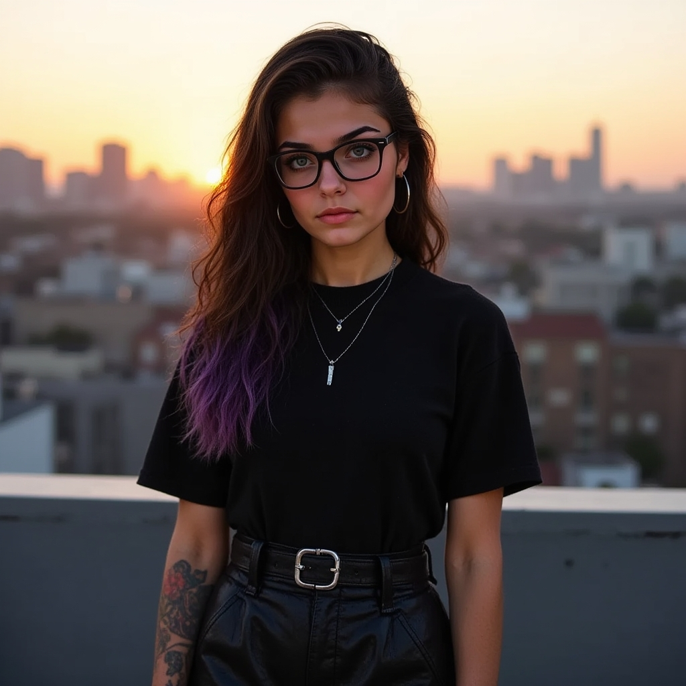

###### Basic Info
Age: 24
Sex: Female
Gender: Nonbinary (presenting female)
Orientation: Queer
Race: White
Nationality: USA
Hair Color: Black
Eye Color: Green
Height: 5'2"
Weight: 95 lbs.
Career: Social Media Influencer

###### Description
**Lyrica Sky** embodies an effortless alternative style that blends modern trends with a timeless edge. She balances conventionally striking features with bold, unconventional beauty choices, crafting an aesthetic that feels both authentic and aspirational. Her look is a blend of the ethereal and edgy: porcelain skin, delicately accented with minimal makeup, juxtaposed against statement accessories and eclectic outfits that range from oversized band tees paired with leather skirts to flowy dark dresses with combat boots. Her style screams individuality while maintaining a broad, relatable appeal.

###### Content Niche & Personality
Lyrica uses her platform to celebrate individuality, self-expression, and creativity. While her striking appearance initially draws viewers in, her genuine warmth, quirky humor, and thoughtful content keep them hooked. She combines fashion, DIY projects, and introspective musings about modern life, love, and mental health in an accessible, unpretentious way. Her feed is a mix of visually stunning photos, raw vlogs, and interactive Q&As where she supports her community with real conversations.

###### Audience Appeal
Lyrica resonates deeply with the Gen Z and Millennial audience seeking relatability mixed with aspiration. Her ability to seamlessly bridge alternative and mainstream appeal makes her a standout in a crowded social media landscape. Viewers love her for being the kind of person who’s not afraid to embrace their imperfections, inspire confidence in others, and bring a touch of whimsy to the everyday.